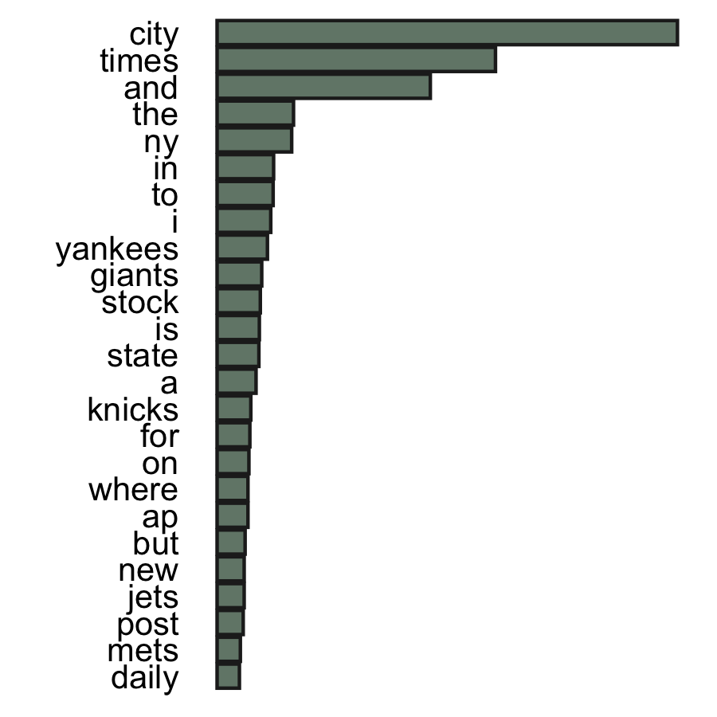

<style>

h1 {
  color: #ABC8B3;
}

h2 {
  color: #ABC8B3;
}

p {
  font-size: 20px;
}

li {
  font-size: 20px;
}

slides > slide.title-slide hgroup h1 {
  font-size: 60px;
  color: #ABC8B3;
}

slides > slide.title-slide hgroup h2 {
  font-size: 24px;
}

</style>

```{r setup, include=FALSE}

knitr::opts_chunk$set(echo = FALSE)

```

## Overview

This app takes a word or several words as inputs, and **predicts the next word**.

Building this word prediction app entailed:

- Creating training and test sets of words blogs, Twitter, and news sites
- Cleaning and preprocessing the training set data
- Developing a prediction model model on the training set
- Testing the model's performance at predicting test set words (see below)
- Optimizing the model & incorporating into a Shiny app

For many of these steps, I utilized the R packages `quanteda`, `tm`, and `stringr`.

## Model algorithm

The prediction model in the app utilizes the <u>**Katz back-off algorithm**</u>, which estimates the probability of a word given its history in a conditional way (Katz, 1987). Given an input word or words, it looks for combination of these words with other words:

- Greater probabilities are given to n-grams that have already been “observed” in the training dataset.
- The algorithm “backs off” through histories of lower-order n-grams, using discounting parameters to downweight those probabilities accordingly. 
- If n-grams have not been “observed” in the training set, “unobserved” n-grams are incorporated based on lower-order n-grams

*Note*: I used unigrams, bigrams, trigrams, and quadgrams *only* for limits on computational power, but one could achieve higher accuracy by using higher-order n-grams. 

*Katz, S. M. (1987). Estimation of probabilities from sparse data for the language model component of a speech recognizer. IEEE Transactions on Acoustics, Speech, and Signal Processing, 35(3), 400–401.*

## Word prediction app: implementation

To build an app that could predict a word relatively accurately in a reasonable amount of time, I made the following choices:
 
- The training set was restricted to only 1-, 2- 3- and 4-grams with frequency greater than 2 in the entire training set.
- The model only makes predictions based on the *final 3 words* in the inputted phrase.

I set several additional "rules" for how the app would behave given differently formatted inputs:

- If there is a sentence break (delineated with `.` `!` or `?`), the app only predicts based on words *following* the sentence break
- Apostrophes and colons, as well as the characters `@` and `#` in the input get removed and replaced with nothing

## Word prediction app: instructions {.smaller}

The final app can be found [here](https://shelbybachman.shinyapps.io/Word-Prediction-App/)!

**Instructions:** Enter a phrase of any length in the text box, and press "Predict".

**Output:** The app shows the 50 most likely next words, in descending order of probability. The relative word probabilities are indicated with a vertical histogram. Sample, shortened output for the input `new york` is shown below:

{#id .class width=40% height=40%}
